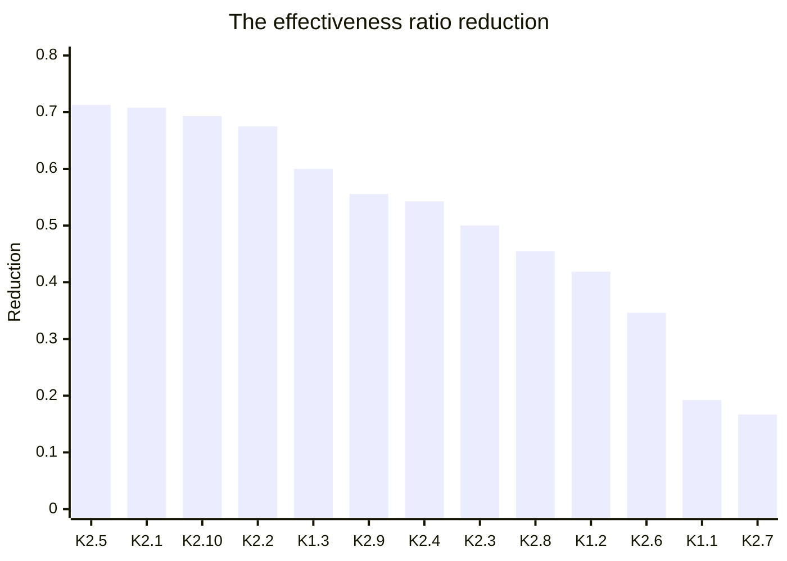

# Understanding the Warning from Obsolete Issue Reports

## Research questions

In software development, programmers use issue trackers to manage maintenance issues and record valuable maintenance details in issue reports. With the evolution of software, open-source communities accumulate a huge amount of revision histories. In recent decades, mining software repositories have been a hot research topic. From issue reports and their patches, researchers have mined rich knowledge that is useful in assisting various programming tasks, e.g., locating bugs and vulnerabilities. Despite the successful stories, the learned knowledge can be unreliable or become obsolete with the evolution of software. Such knowledge is misleading and harmful. However, to the best of our knowledge, no study has explored this problem, and many research questions are still open. For instance, which knowledge can be learned? How can such knowledge become obsolete or unreliable?

To answer these questions, we build a tool, ICLinker, that calculates the obsolete ratios for issue reports. ICLinker links commits of a project to issue reports from the issue tracker system. It compares the commits with its corresponding latest source file, and calculates an obsolete ratio for each issue report. The obsolete ratio is calculated as the proportion of its added lines that cannot match the latest source files. With ICLinker, we answer the following research questions:

**RQ1. What kinds of knowledge can be learned from resolving issue reports?**

**RQ2. Can obsolete issue reports affect their knowledge?**

**RQ3. How many obsolete issue reports are there?**

**RQ4. How are obsolete issue reports mentioned in the code comments?**

## General protocol
To explore the knowledge, distribution, and references of obsolete issue reports, our analysis protocol has the following steps:

*Step 1. Calculating the obsolete ratios of issue reports.* We build a tool, ICLinker, to inspect the obsolete issue reports and calculate the obsolete ratios. ICLinker calculates an obsolete ratio for each issue report. It indicates to what degree an issue report is obsolete. ICLinker calculates the obsolete ratio by comparing the latest source file with the added lines of its commit.

*Step 2. Categorizing the knowledge learned from resolving issue reports.* We collect 396 issue reports with obsolete ratios of 0 and 1 from 9 projects. For each issue report, we manually classify the knowledge learned from resolving the issue report by analyzing its content, the code modifications of corresponding commits, and commit messages.

*Step 3. Investigating whether obsolete issue reports can affect their knowledge.* We then manually check whether the learned knowledge is valid for the latest project. In this step, we analyze all the 396 issue reports. We use statistical hypothesis testing to check whether obsolete issue reports can affect their knowledge.

*Step 4. Discovering the references of obsolete issue reports from code comments.* For each obsolete issue report, we extract its issue number from code comments and analyze to what degree obsolete issue reports are mentioned in the code comments of the latest source files.

## Our findings

**RQ1. The Knowledge.** Based on whether the knowledge is specific to a project, we classify the knowledge into domain knowledge and project-specific knowledge. In particular, project-specific knowledge is learned for 75% of issue reports. The most frequent project-specific knowledge is about writing documents and algorithms, and the most frequent domain knowledge is about API calls (Finding 1).

<table border="13" >
	<tr >
		<td rowspan="3">K1. Domain Knowledge(99/396, 25%)</td>
		<td>K1.1. API call (49/396, 12.37%)</td>
	</tr>
	<tr >
		<td>K1.2. Compile configuration (41/396, 10.35%)</td>
	</tr>
  <tr >
		<td>K1.3. Others (9/396, 2.27%)</td>
	</tr>
  	<tr >
		<td rowspan="10">K2. Project-specific Knowledge (297/396, 75%)</td>
		<td>K2.1. Document (message) (55/396, 13.89%)</td>
	</tr>
	<tr >
		<td>K2.2. Algorithm (54/396, 13.64%)</td>
	</tr>
  <tr >
		<td>K2.3. Configuration (45/396, 11.36%)</td>
	</tr>
  <tr >
		<td>K2.4. Test (44/396, 11.11%)</td>
	</tr>
  <tr >
		<td>K2.5. Initialization (28/396, 7.07%)</td>
	</tr>
  <tr >
		<td>K2.6. Debug (19/396, 4.80%)</td>
	</tr>
  <tr >
		<td>K2.7. Refactoring (13/396, 3.28%)</td>
	</tr>
  <tr >
		<td>K2.8. Script (11/396, 2.78%)</td>
	</tr>
  <tr >
		<td>K2.9. Annotations (10/396, 2.53%)</td>
	</tr>
  <tr >
		<td>K2.10. Others (18/396, 4.55%)</td>
	</tr>
</table>

Table 1. The full taxonomy of knowledge. $$ratio_{c} = \frac{N_{c}}{N_{all}}$$, where $N_{c}$ is the number of the knowledge in category $C$, and $N_{all}$ is the number of all the knowledge learned from resolving issue reports, i.e., 396.

We manually classified the knowledge learned from resolving the issue report. The details are in：
[RQ1](https://github.com/gongsiyi/obsolete_issue_reports/blob/main/RQ1.xlsx)

**RQ2. The Effectiveness of Knowledge.** Obsolete issue reports significantly affect their embedded knowledge (Finding 2). Compared to domain knowledge, project-specific knowledge is more likely to be affected by obsolete issue reports. Among them, the initializations are the most affected knowledge, and its reduction of effectiveness ratio is 0.7128 (Finding 3).

Fig1. The effectiveness ratio reduction of knowledge. $$reduction_{e_{c}} = \frac{N_{e_{c_{0}}}}{N_{c_{0}}} - \frac{N_{e_{c_{1}}}}{N_{c_{1}}}$$, where $N_{e_{c_{0}}}$ is the number of fresh issue reports whose knowledge is effective, $N_{c_{0}}$ is the number of total fresh issue reports, $N_{e_{c_{1}}}$ is the number of obsolete issue reports whose knowledge is effective, and $N_{c_{1}}$ is the number of total obsolete issue reports.

**RQ3. The Distribution.** Projects with more commits typically have higher obsolete ratios (Finding 4). Recent issue reports have lower obsolete ratios than old issue reports. Despite the trends, obsolete issue reports are mixed with other issue reports (Finding 5).

We identified the obsolete ratios of the issue reports from nine projects. Their obsolete ratios are as follows: 
[aries](https://github.com/gongsiyi/obsolete_issue_reports/blob/main/aries.txt), [calcite](https://github.com/gongsiyi/obsolete_issue_reports/blob/main/calcite.txt), [cassandra](https://github.com/gongsiyi/obsolete_issue_reports/blob/main/cassandra.txt), [derby](https://github.com/gongsiyi/obsolete_issue_reports/blob/main/derby.txt), [flink](https://github.com/gongsiyi/obsolete_issue_reports/blob/main/flink.txt), [geode](https://github.com/gongsiyi/obsolete_issue_reports/blob/main/geode.txt),  [hbase](https://github.com/gongsiyi/obsolete_issue_reports/blob/main/hbase.txt), [hive](https://github.com/gongsiyi/obsolete_issue_reports/blob/main/hive.txt), and [nutch](https://github.com/gongsiyi/obsolete_issue_reports/blob/main/nutch.txt).

**RQ4. Reference in Code Comment.** The obsolete ratio medians of issue references in code comments are around 0.5, and obsolete references are mixed with other references (Finding 6).

